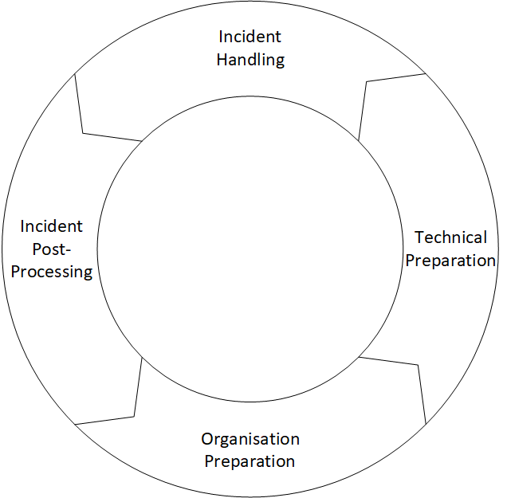

# Open Cloud Computing Incident Response Framework (OCCIRF)
The *Open Cloud Computing Incident Response Framework (OCCIRF)* is an open source framework to help you prepare for
incidents in a cloud environment. This framework not written for a specific cloud. It supports all cloud solutions and
is a more generic framework.  
This framework is more focused on the process of the incident response. In the [examples](examples) folder you can find
some examples how to implement given tasks in the cloud. The framework is divided in four main parts:

1. [Preparation](preparation)
   1. [Organisational preparation](preparation/organisational.md)
   2. [technical preparation](preparation/technical.md)
2. [Handling](handling)
3. [Post-processing](post)

As nowadays more organisations are not only cloud service customers but also cloud service providers the framework is
dividing the process at some places in those two parts if there are differences.

This process framework is not a complete framework for all the needed processes. The scope is only the cloud incident
response. It is always recommended following ITIL as an IT process management framework. In ITIL following processes are
a good start to complete this process:
- Asset and Configuration Management
- Change management
- Incident Management
- Security Management

## Quick Start
As most of us don't want to read the documentation we developed a quick start checklist to immediately start working on
the process. The checklist does not fully replace the full documentation, but it is a quick way to start working on the
process.

Go to the [quick start checklist](quickStart.md)

## Content

| Index                      | Description                                   |
| -------------------------- | --------------------------------------------- |
| [Preparation](preparation) | Preparation for the incident response process |
| [Handling](handling)       | Handling of an currently occurring process    |
| [Post-processing](post)    | The post processing of the occurred incident  |
| [Examples](examples)       | Examples of possible implementations          |
| [Templates](templates)     | Templates for the process documents           |

## Description

## Annotations

## Authors

* **[masteroflittle](https://github.com/masteroflittle)** - *Initial work*

See also the list of
[contributors](https://github.com/masteroflittle/OpenCloudComputingIncidentResponseFramework/contributors) who
participated in this project.

## License
This work is licensed under a [Creative Commons Attribution-NonCommercial-ShareAlike 4.0 International License](http://creativecommons.org/licenses/by-nc-sa/4.0/).
See the [LICENSE](LICENSE.md) file for details.

