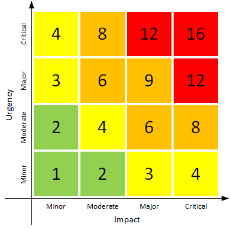

# Incident classification
To handle and escalate an incident properly the incident has to classified. This classification should be done in a way
where all involved parties are on the same page.  
In ITIL and the ISO/IEC 20000 a product of the impact and the urgency should be used. This product is then the priority
or severity of the incident. ***TODO: Get ISO 20000 and ITIL references***

## Impact classification
The impact classification can be chosen freely. The impact should describe how the company is impacted if the system
gets hacked or is unavailable. E.g. a system which handles user data or is the front end of the company is more critical
than a simple internal web application without critical data. In this example a scale from one to four is used. This
helps divide the different systems in different categories:

1. Minor: A minor impact to the company (No loss of reputation or financial impact)
2. Moderate: A moderate impact to the company (Little loss of reputation or money)
3. Major: A high impact to the company (High reputation or financial impact)
4. Critical: A critical impact to the company (This system is mission critical and without it the company is in great
danger)

The measurement for the impact can differ from company to company. Some characteristics might be the influenced users,
the confidentiality of the stored data, financial impact or reputational impact.

## Urgency classification
Another factor of an incident classification is the urgency. The urgency is mostly determined a service-level agreement
(SLA). Here always the highest SLA should be used to determine the urgency. This can then also be put into a scale to
determine the urgency level. These levels might be:

1. <= 95.00%
2. <= 99.00%
3. <= 99.95%
4. \> 99.95%

## Combined incident classification
The impact and the urgency can then be combined to classify the incident, and the needed time to react or resolve the
incident.

Following figure shows the matrix with the product of the urgency and the impact of an incident:  

In this example the severity or priority is divided in four categories with representing resolve times:

* 1 - 2 (Green): Minor incident: Resolve time up to 36h
* 3 - 4 (Yellow): Moderate incident: Resolve time up to 24h
* 6 - 9 (Orange): Major incident: Resolve time up to 8h
* 12 - 16 (Red): Critical incident: Resolve time up to 2h