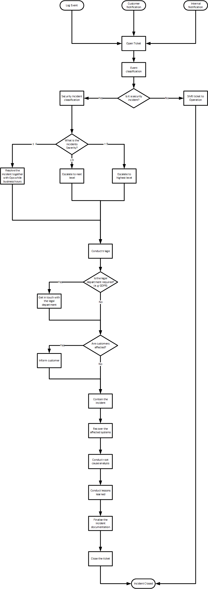
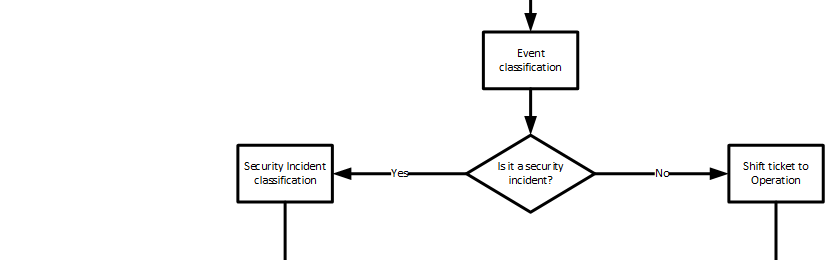
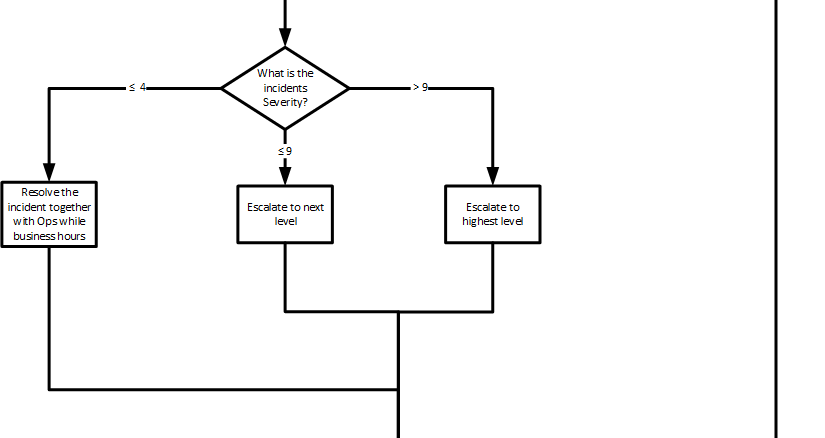
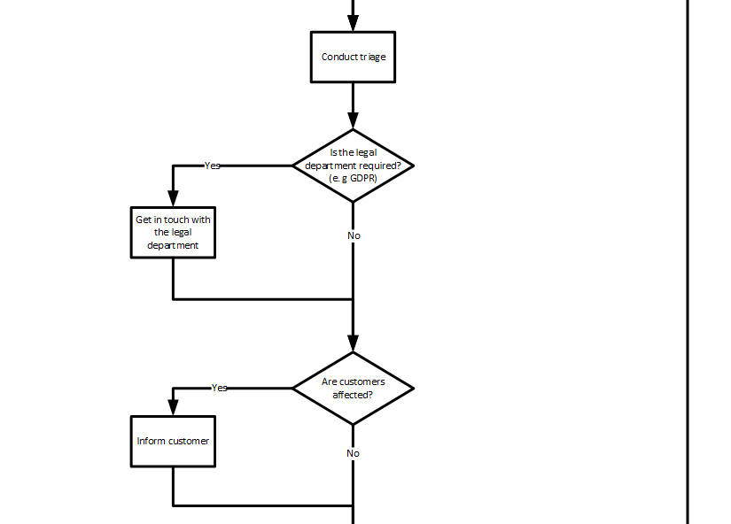
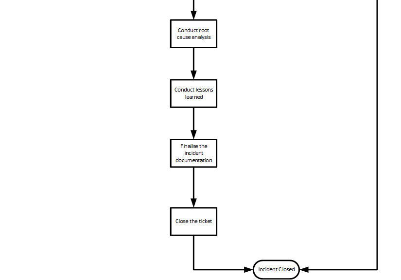

# Example Process
This example contains a process for an incident. This example is based on the ITIL Incident Management process.

1. [Full Process Workflow](#full-process-workflow)
1. [Parts of the Process](#parts-of-the-process)
   1. [Ingest of an Event](#ingest-of-an-event)
   1. [Classification of an Event](#classification-of-an-event)
   1. [Incident Classification and Escalation](#incident-classification-and-escalation)
   1. [Triage and Notifications](#triage-and-notifications)
   1. [Containment and Recovery](#containment-and-recovery)
   1. [Root Cause Analysis and Finalization](#root-cause-analysis-and-finalization)

## Full Process Workflow

The Visio file can be downloaded [here](visio/processFlow.vsdx)
## Parts of the Process

### Ingest of an Event

The first action in this process is the intake of an event. This may vary in all corporations how events are handled
there. In this example there are three input possibilities. The first one should be possible in every organisation.
This is the event from a log source. Preferable this should be a central log aggregator or a SIEM
(see [log preparation](../preparation/technical.md#log-preparation)). The next possible option for an event input might
be a customer notification via defined customer interfaces (e.g accountant manager or a support system). As the last
possibility in this example an internal notification is stated here. This might be a developer or an operation employee
finding something strange.  
All those input possibilities need to be documented in a ticket, which will be open for each request. This ticket is
then the source of truth for this event. 

### Classification of an Event

After an event is recorded in the ticketing system it has to be classified. This classification process decides if the
event is a security event or just a normal inquiry for the operation or development teams.  
If the ticket is not
classified as an incident it will be shifted to the corresponding team and closed within the incident response process.

### Incident Classification and Escalation

If the event is classified as an incident the severity of this incident has to be defined. This helps to inform the
proper team members and defines the response time frame. An example classification can be found 
[here](incidentClassification.md).  
In this example the severity is divided in three criticality levels. The first one is "low" where it is an incident
which does not harm anything but has to be taken care of. This can mostly be done in the business hours. The next level
would be "high" in this scenario the incident is sever as systems or data is affected which might harm the company.
Here an immediate reaction is necessary to fight against this threat. The last level is "critical" here the company is
in severe danger, and the highest level needs to perform actions to compat this incident.

### Triage and Notifications

As the incident is classified and the proper team members are informed the triage of the incident can start. In the
triage phase the event is analysed. This is needed to get an overview of the damage and the ongoing threat to the 
company's systems.  
Also, in this phase the needed departments should be contacted (in this example the legal and customer relation
departments). This can be done while the triage is ongoing or directly after that. The sooner the departments are
contacted the better it is normally.

### Containment and Recovery

When the incident is analysed and the threats are identified the incident can be contained. In this phase the incident
response team tries to hold in the actions of the attacker. This might be through isolating the affected systems or 
isolating the threat inside those. Also, it might be possible to lock out the attacker from the environment.  
After the containment of the incident the affected systems need to be recovered. Here the incident response team have to
eradicate the changes the attack did to the systems. An operation team from this service might be helpful to recover the
systems to a known good state.

### Root Cause Analysis and Finalization

After the danger for the attack is remediated the analysis of the root cause can start. The root cause analysis is
searching for the initial attack vector and the movement between the affected systems. This needs to be done to harden
the system for further attacks with the same attack vector.  
To finalize this incident it is also important to conduct lessons learned. In this step, step all previous steps will be
investigated to check if there is something the response team or the affected project teams can improve. Further more
the organisation should be informed about this incident to further harden the whole environment.  
The last step is to finalize the documentation of the incident and close the ticket.