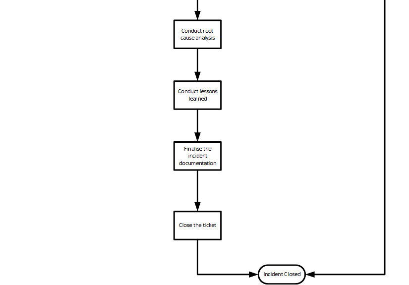

# Example process
This example contains a process for an incident. This example is based on the ITIL Incident Management process.

## Full process workflow

The Visio file can be downloaded [here](processFlow.vsdx)
## Parts of the process

### Ingest of an event

The first action in this process is the intake of an event. This may vary in all corporations how events are handled
there. In this example there are three input possibilities. The first one should be possible in every organisation.
This is the event from a log source. Preferable this should be a central log aggregator or a SIEM
(see [log preparation](../preparation/technical.md#log-preparation)). The next possible option for an event input might
be a customer notification via defined customer interfaces (e.g accountant manager or a support system). As the last
possibility in this example an internal notification is stated here. This might be a developer or an operation employee
finding something strange.  
All those input possibilities need to be documented in a ticket, which will be open for each request. This ticket is
then the source of truth for this event. 

### Classification of an event

After an event is recorded in the ticketing system it has to be classified. This classification process decides if the
event is a security event or just a normal inquiry for the operation or development teams.  
If the ticket is not
classified as an incident it will be shifted to the corresponding team and closed within the incident response process.

### Incident Classification and Escalation

### Triage and Notifications

### Containment

### Root cause analysis and finalization
