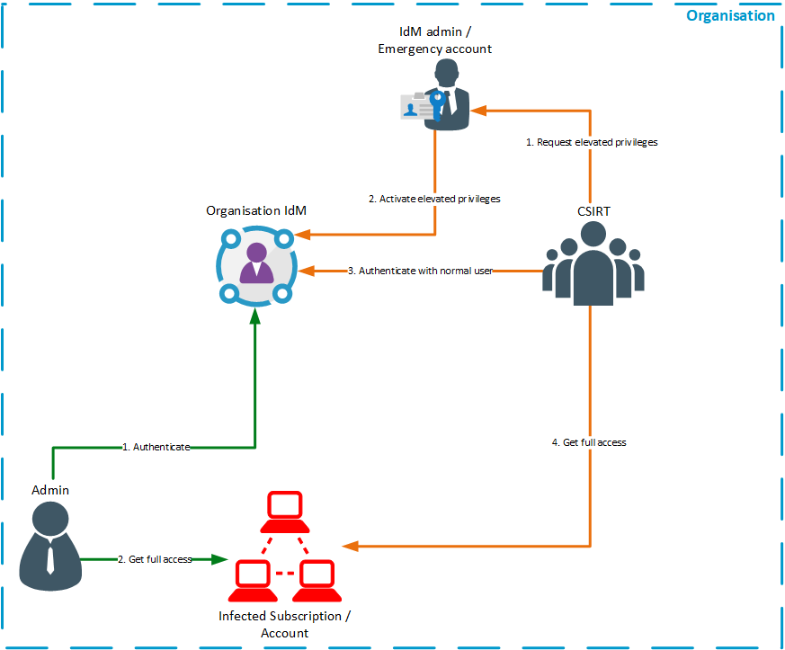

# Organisational Incident Preparation
The preparation is an integral part of the incident response process. Here you need to plan and prepare your strategy
and your tools. In this chapter the focus is on the organisational preparation.

1. [Asset management](#asset-management)
1. [Roles and responsibilities](#roles-and-responsibilities)
   1. [Incident Response Team](#incident-response-team)
      1. [On-call team](#on-call-team)
      1. [Incident Investigators](#incident-investigators)
      1. [Incident Manager](#incident-manager)
      1. [Communication Manager](#communication-manager)
      1. [Trainers](#trainers)
   1. [Other internal departments](#other-internal-departments)
      1. [Legal Manager](#legal-manager)
      1. [IT operations](#it-operations)
   1. [Providers](#providers)
   1. [Customers](#customers)
1. [Access concept](#access-concept)
   1. [Normal access](#normal-access)
   1. [Emergency access](#emergency-access)
1. [Communication](#communication)
   1. [Communication to the cloud provider](#communication-to-the-cloud-provider)
   1. [Internal communication](#internal-communication)
   1. [Communication to customers](#communication-to-customers)
   1. [Communication to law enforcements](#communication-to-law-enforcements)
   1. [Communication to other Incident Response Organisations](#communication-to-other-incident-response-organisations)
1. [Process documentation](#process-documentation)
1. [Governance and Policies](#governance-and-policies)
1. [Training](#training)
   1. [External trainings](#external-trainings)
   1. [Internal training](#internal-training)
   1. [War game](#war-game)
      1. [With CSIRT notification](#with-csirt-notification)
      1. [Without CSIRT notification](#without-csirt-notification)

## Asset management
To properly react to an incident in the own environment an asset management needs to be established. The asset
management contains all relevant assets which might be helpful in an incident case. Those assets are (not all):

- Accounts or Subscriptions (Public Cloud/SaaS)
- Running services
  - IP addresses
  - Servers / components (like databases, application server services)
  - Service owners
  - Criticality
  - Processed data
- Responsible department
- Risk assessment
- Architecture

Those fact sheets can be stored in an asset management tool or a simple database (See
[examples/assetManagement](../examples/assetManagement.md)). Also, an offline version is possible as in an incident case
it is not guaranteed that the online asset management tools are accessible (See
[templates/assetFactsSheet](../templates/assetFactsSheet.md)).  
The more precisely the facts sheets are the easier it is to get all needed assets in an incident case. To assure that
all facts sheets are up to date a periodic review should be done.  
For a deeper dive into this topic the ITIL contains information about IT asset management.
   
## Roles and responsibilities
Defined responsibilities are important in an incident process as all involved persons need to know what they need to do.
The employees within the set responsibilities should be skilled to handle those in a pressure situation like an incident
event. The roles and responsibilities should also be documented. An example document can be found
[here](../templates/rolesAndResponsibilities.md).

### Incident Response Team
#### On-call team
The on-call security team is the main contact and initial responder to all suspected security events. They should be
staffed for 24/7. They are responsible for evaluating incoming events and classify them accordingly. The on-call team is
notifying the incident investigators to handle the incident, if one is detected. 

#### Incident Investigators
The incident investigators are collection and analysing evidence of the incident. They try to find the root cause if the
incident and will implement short-term mitigation measures. The lead investigator is controlling the actions of the
investigations team and direct the tasks of them.

#### Incident Manager
The incident manager responsible for handling the incident on the non-technical side. He is controlling the processes
and is deciding together with the lead investigator the next steps. He is also coordinating the response activities and
keeps the team focused on the incident. To help the team he can refer to other departments like the service teams or the
upper management.

#### Communication Manager
The communication manager is handling all sorts of communication to other parties who are involved in the incident. He
writes press releases or notifications to customers if they are affected. Also, an important communication partner are
the law enforcements as legal responsibilities are needed to be followed (Like GDPR or KRITIS in Germany). He is
responsible for internal communications, too. E.g. communicating the comments on the incident and the affected systems
to the internal employees.

#### Trainers
It is very important to train the different departments regarding incident response and general security. If there is no
ongoing incident the team members of the incident response team should train the colleagues to improve the security
knowledge. The trainers are not relevant for an incident, but they are helping a lot to prevent those.

### Other internal departments
#### Legal Manager
The legal manager is responsible for legal questions for the incident. He as to provide contact details to authorities
to the communication manager or work with him together on statements for them. He can also consult the management, or
the incident response team in legal questions. Moreover, he needs also help the team in GDPR topics if there is no
dedicated department for data protection in the organisation.

#### IT operations
Normally the IT operations are responsible for the deployed solutions. In an incident case they have the most knowledge
about their infrastructure. The incident response team should be able to get in touch with those operation teams if they
can help resolve the incident. Those contacts need to be stated in the asset facts sheet, so a contact person is always
known.

### Providers
As all cloud solutions are based on a provider it is important to have a direct line of contact to them. For that case a
single point of contact is important. This contact is always reachable and can support the incident response operations.
The single point of contact can be a support team or the Security Operations Center (SOC). This point of contacts should
be regularly reviewed and tested.

### Customers
It is also important to notify the customers in case of an incident where the data of those customers are affected. This
needs also be planned accordingly to be satisfy legal requirements and corporate policies. A list of customers should be
easily accessible to inform potential affected customers.

## Access concept
The access concept for incident response is an interesting topic. Here it is important to guarantee quick reaction times
but also honor the least privileges principle. Here the CSIRT needs to balance the least privileges concept and the
possibility to quickly access any affected systems.

### Normal access
While normal operating the CSIRT needs access to the project accounts/subscriptions only as read-only users. Read-only
access is necessary to get log data or metrics to a central log environment. The best way to guarantee the read-only
access is to force this via an identity management system (Like the Azure AD or AWSs IAM). This identity management
system forces the CSIRT group into all corporate subscriptions/accounts.

### Emergency access
When an incident is occurring in the environment the incident response team needs to access the environment quickly to
contain the incident. As the CSIRT cannot have full access to all environment at all time a 3rd party needs to grant the
elevated access. This 3rd party as a trusted source helps to guarantee a four-eyes principle and that the principle of
least privileges his honoured. A workflow for this access could look like following:

1. The CSIRT team members requests the privileges at the trusted party
2. This trusted party logs into the IdM system and grants the specific users full access to the requested environment
3. The CSIRT team members can now authenticate with their normal users at the IdM to get the higher privileges
4. The team has full access into the infected environment

There are different possibilities to define the role of the trusted party to grant the CSIRT members access to the
infected environment. The first possibility is that the contact is an admin from the IdM admin team which is also
on-call. The second option is that a manager on duty or someone from the operations team for this environment can handle
those access rights and give them to the team. A third and possible fasted way to handle the emergency access is a
breaking-glass account which is handled by the manager on duty of the CSIRT. A breaking-glass account is an account
which is only there for emergency access and is able to delegate specific access roles to a set of users. In this
scenario the incident handler is requesting access from his manager. The manager then uses this special account in the
identity manager to grant the incident handler access to the subscription. All those administrative actions have to be
of course be logged and alerted. Also, a timeline needs to be specified for the validity of the accounts. So they can be
removed when they are no longer needed.
A template for the emergency access can be found [here](../templates/emergencyAccess.md).

## Communication
The communication of the incident is also very important. Especially when someone outside of the organisation has to be
informed about an incident. The communication should always be done by the communication manager or a trained
communication employee if possible. The communication is key for the reputation of the affected organisation. Also, it
is important to communicate clear and through defined channels. Which is also in responsibility of the communication
manager.

Communication examples can be found [here](../examples/communication.md).

### Communication to the cloud provider
The communication to the cloud provider is needed when an incident is reported by the cloud provider or is also
affecting their systems. Here a more technical communication should be preferred between both CSIRTs. The communication
needs to be clarified when the shared responsibility is defined in the contracts. This can also be done in the UI of the
Cloud providers like Azure does it with the security contacts.

### Internal communication
Internal communication is important to inform the employees about incidents generally. When some employees are affected
they also should be separately notified to guarantee the security of those employees. Also, when the incident is closed
the whole company can be informed about that to lean what can be improved (lessons learned). If the CSIRT needs help
from different teams a communication channel to those also needs to be established via the communications manager or
directly via the line managers.

### Communication to customers
The communication to customers is a sensitive topic. Here the customer needs to be informed what happened and if any of
his data is affected. The communication is important to gain trust back from the customers that the organisation can
handle the incident properly. Also, your publicity in the media is affected by that. A notification about an incident
should be honest and clear for the customers. The fastest way to inform the customers about this incident can be through
e-mail as most of the time the e-mail is known in a cloud solution. In the e-mail the incident should be explained
transparently and should explain what happened in the environment. It should also explain what happened to the customer
data. The e-mail should clarify everything and should not hide the real impact or the severity of the incident. The
communication to the customer should be done by experts in this topic with help from the legal department. The CSIRT
should only provide the technical details.  
Examples for a communication to the customers can be found [here](../examples/communication.md#external-communication).

### Communication to law enforcements
Communicating to law enforcements can be necessary if a local law enforces that. This can be for example the GDPR if
personal related data is processed. Also, when the incident is reported to the police this communication is necessary.
The communication should never be done by someone without knowledge of the respective laws. For this communication the
legal department should be contacted that they can do this.

### Communication to other Incident Response Organisations
To stay up to date it is important to exchange knowledge with other incident response organisations. This helps to
identify new attacks which where already discovered by other CSIRTs. Most states have an own CSIRT where a corporation
CSIRT can get information from. Besides, the CSIRT can join a global organisation like [FIRST](https://www.first.org/).
Also, it is possible to use sharing software like the
[Malware Information Sharing Platform (MISP)](https://www.misp-project.org/) to share information with other CSIRTs.

## Process documentation
The preparation of the incident response process should also contain the documentation for that process. A process
documentation is important as this document guides the team through the process. The process needs to be tailored to the
organisation and the departments, which are part of the incident response process.  
A process example can be found [here](../examples/process.md).

## Governance and Policies
Governance and policies are the foundation for a well planned incident response process. The policies are defining on a high
level how this process is built and who is responsible for the different parts. The policies apply corporation wide and
are most likely binding for all employees. The governance department is defining the polices. In the case of the
incident response process the policies should define following terms:

- Scope of the policy
- Definition of IT security incidents
- Mission of the CSIRT
- Tasks of the project teams (e.g. contacts, on-call service, reporting)
- General reporting
- Communication guidelines and plans
- Escalation processes
- Prioritization and ratings of incidents
- Guidelines for developers to provide information to the CSIRT

The policies should be on a high level to leave some room for the project to adapt the policies. The policies could be
derived from the ISO 27001 standard (e.g.
[ISO 27001 - Annex A.16](https://www.isms.online/iso-27001/annex-a-16-information-security-incident-management/)).

Following examples are available:
- [Incident Classification](../examples/incidentClassification.md)

## Training
Training is important for all IT security professionals. Trainings are needed to keep up with the newest technologies
and threats in the IT environments. Those trainings might be internal trainings or external trainings at e.g.
conferences.

### External trainings
External trainings are trainings outside of the organisation where the IT security specialist can learn new technologies
or increase his own knowledge in a specific topic. Those trainings are important as new technologies and threats are
always rising in on the internet. Also, an employee whose responsibility is incident response needs to know which
threats are important for his work and the company. For example the public cloud topics is something where the incident
handlers need to be trained in as this topic is fairly new and changing rapidly.  
The employees should have enough budget to attend important trainings. These trainings should be selected by the
employee together with the line manager to guarantee an optimal fit for his position. When the employee is back from the
training he can share his learned knowledge with his colleagues to enable the whole team with the newly learned.

### Internal training
Internal training helps to distribute knowledge from one employee to another. This can be something this employee
learned on the job or while on an external training. A knowledge base like an internal wiki can be helpful to document
the knowledge. The NIST has also developed a framework to help corporations training their employees. This framework is
called [National Initiative for Cybersecurity Education (NICE)](https://www.nist.gov/itl/applied-cybersecurity/nice). 

### War game
A war game is a strategic simulation of an event which is normally used by the military to train a case of emergency. In
IT a war game is also a simulation of an event. This event can be a serious incident or any other event where training
is necessary.  
The war game for the incident response team should help the team train the handling of an incident and disclose possible
opportunities for improvement. The actions of the response team should be documented and rated by a third party and
discussed afterwards for optimal improvement (See [war game evaluation](../templates/warGameEvaluation.md)). A war
game should be carefully planned with the responsible persons of the target environment and with the management of the
CSIRT. For the war game a testing system for the target environment can be chosen. The generated events should be
documented (See [war game preparation plan](../templates/warGamePreparation.md)). A red/purple team can help simulate
the attacker. This is then also a good practice for them. To track the actions the red/purple team has made the attack
should be documented. This can be then compared to the analysis of the CSIRT.  
If a red/purple team is not available events can be generated manually in most of the cloud environments or
applications.  
In addition to the templates there are also some examples [available](../examples/warGame.md).

#### With CSIRT notification
The easier version of a war game is the version where the CSIRT is notified about the war game. Within this scenario the
processes can be tested without pressure of a real live situation. This scenario is also great to train new employees
and show them how the incident process works. The drawback of this scenario is that the CSIRT knows that this is a
training and they might not take this as seriously as a real incident. 

#### Without CSIRT notification
The war game without notifying the CSIRT is more close to the reality than the scenario with the notification. Here the
CSIRT has to handle the incident as it is a real one without help of the team which has started the war game. This
scenario can give a better view on how the team handles incidents and where optimisation is needed. Furthermore, this
scenario gives also an indication how fast the CSIRT can response to an incident and how well prepared they are. The
drawback of this scenario is that the CSIRT is bound to this incident and might not be able to respond to a real
incident. For this situation a fallback plan has to be implemented in which the management of the CSIRT is informed
about the war game. If then a real incident happens the CSIRT can shift the priority to the real on and leave the war
game as it is.