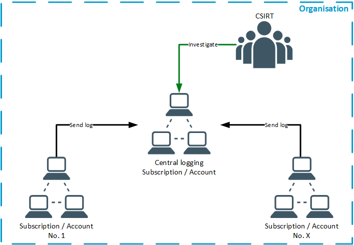

# Technical Incident Preparation
After the organisational preparation is done the tools and technical settings can be done to prepare the incident
response process. This chapter is focusing on this.

{ToC}

## Logging
An important part, if not the most important part of the technical preparation is to prepare the logging process. In
cloud environments logs are most of the time the source of truth for actions happening in the cloud. Also, if platform
services are used it is most likely the case that the administrator, nor the security team has access to the file system
to analyse security events with forensic tools.  
The log entries are one of the most important source of information about the health of a system and a great indicator
of a possible compromise or other incident. Log files are there to trace certain events through an application and whole
environments. Therefor log files need to be central aggregated and configured to have e.g. the same time source and time
zone.  
Further more log entries needs to be protected from manipulation or deletion from unauthorized parties.

### Data Sources
To get meaningful data out of the logs proper data sources have to be implemented or configured. Most cloud provider
offer a wide variety of possible log sources. Those data sources need to be delivered into the log aggregator. Possible
logs are following:
* Identity management
* Cloud API
* Flows form virtual networks
* Infrastructure (E.g VM logs, kubernetes logs)
* Application (E.g. Web application, database)

Without proper data sources configured the log analysis gets complicated as there is not enough data available to
analyse and correlate. Examples for the different log sources can be found [here](../examples/dataSources.md).

### Log Aggregation
With the separation of different development projects into different subscriptions or accounts a centralized logging and
investigation platform has to be established. This should be done in a separate subscription or account where the CSIRT
can then correlate all needed events. The central correlation is important to see attacks in different environments.
E.g. An IP address is generating suspicious events in one environment, with central logs it can be checked if this IP is
also targeting different environments.

For this central logging approach the CSIRT or another SOC Team has to provide a central solution where all project
teams can send their log to. Examples can be found [here](../examples/centralLogging.md).

### Log Analysis
When the log files are centrally stored they can be analysed. Without analysing the log files no events can be found and
reacted to. Log analysis is the step where the raw log lines gets correlated with each other and analysed for malicious
behavior or known patterns. 

#### SIEM
A Security Information and Event Management (SIEM) System is a tool which helps to analyse and correlate log events.
Those tools are great to manage all sorts of events and log sources for the environments. Also, alerts can be generated
easily in those systems to notify the on-call teams in an emergency event.  
Most cloud providers have a SIEM solution in their portfolio. Furthermore, open source products or 3rd party products
are also available. Examples can be found [here](../examples/siem.md).

#### Playbooks
After the log files are stored and processed centrally, playbooks can be defined. Playbooks are a set of rules which
will trigger actions when specific log events pop up. These actions can be only notifications to the security analyst or
specific actions like locking an account. These playbooks need to be tailored for the needs of the environment and the 
CSIRT. Examples can be found [here](../examples/playbooks.md).

## Monitoring
Not only log events are helping find events, also monitoring of the cloud environment can give indicators of compromise.
Monitoring helps visualise trends for the monitored KPIs. Those KPIs might be:
 * Costs of the booked services
   * Here a malicious actor might started services to mine e.g. crypto currencies 
 * Utilization of resources (CPU, RAM, Storage)
   * High utilization of CPU usage might be caused by a DOS attack or some malicious software
 * Network usage (in- and outgoing traffic, sessions, delays)
   * Higher than normal traffic might be caused by data exfiltration (outgoing traffic) or a DOS attack (incoming
   traffic)
   * Burst request from a single IP address. This could be recon from that address.
 * Service availability (Host checks, network availability)
   * Non responsive hosts might be caused by a DOS attack, a manipulation of the system or a host failure

Monitoring examples can be found [here](../examples/monitoring.md).

## Visibility
Not only is it important, that log files are sent to a central logging tool but also that logs are generated. Before
logs are generated information needs to be visible in the environment to be able to be picked up by the logging tools.  
Here the developers and the operations team are in duty to provide the necessary information to the logging and
monitoring systems. To force the developers and project teams to implement those measures a corporate policy might be
helpful. 
 
## Access
An access concept was already a topic in the [organisational preparation](organisational.md#access-concept). In the
organisational preparation the process was defined how the CSIRT gains access to an infected environment. In the
technical preparation the technical configuration part needs to be done. Here it needs to be defined what is needed to
access an environment. This includes:
 * Personal accounts for the respective cloud providers
 * Documented logins ULRs to gain access to the cloud interfaces
 * Roles to gain access to the different subscriptions / accounts

***@TODO: describe more here***
 
## Data Export
When an incident happens the data might need to get extracted from the environment for further analysis. This can get
complicated when the data don't be located on an infrastructure service (like a VM). If the data is stored on a platform
service it isn't that easy to export them. Here are normally API calls necessary or different roles to get the data.  
In the planning process of the incident response the CSIRT and the operation team should plan on how to export needed
data in an incident case.  
Examples can be found [here](../examples/dataExport.md).

## Response Tool Chain
The CSIRT needs to be able to react quickly and efficiently to an incident. There are tools available which helps
achieve that. Those tools ne to be handy and quickly operational. For that a response tool chain in the cloud is
helpful.  
This toolchain helps the CSIRT to quickly gather all information and initialize all necessary steps. The toolchain might
be a set of serverless services or a full VM which can be spun up in the cloud environment. THis toolchain needs to be
maintained and set up for the needed use cases. E.g. it is not target-oriented to have a toolchain ready for OS
forensics when all environments are PaaS only.  
Example tools can be found [here](../examples/tools.md).